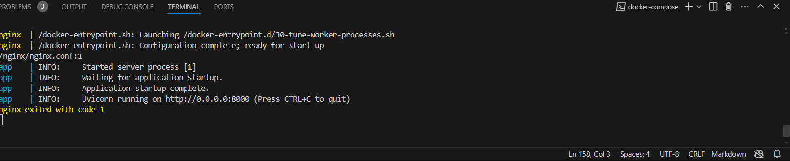

# Projeto Flask para FastAPI com Docker e NGINX

#### Alysson c c cordeiro (eng comp)

Este projeto é uma conversão de uma aplicação Flask para FastAPI, utilizando containers Docker para implementação e NGINX como um gateway. O objetivo é criar uma aplicação de blog simples com endpoints CRUD para posts de blog, e logar todas as requisições com nível de aviso (WARNING) ou superior.

## Estrutura do Projeto


```python
p2_m10/
├── app/
│   ├── main.py
│   ├── requirements.txt
│   └── Dockerfile
├── nginx/
│   ├── nginx.conf
│   └── Dockerfile.nginx
└── docker-compose.yml
```


## Arquivos e Diretórios
app/: Contém a aplicação FastAPI.

main.py: Código principal da aplicação FastAPI.

requirements.txt: Dependências da aplicação.

Dockerfile: Arquivo Docker para a aplicação FastAPI.

nginx/: Contém a configuração do NGINX.

nginx.conf: Configuração do NGINX para o proxy reverso.

Dockerfile.nginx: Arquivo Docker para o container do NGINX.

docker-compose.yml: Arquivo Docker Compose para construir e orquestrar os containers.

## Como Executar

Pré-requisitos

`Docker`

`Docker Compose`

## Proximos passos.

Clone o repositório:


`git clone https://github.com/alyssoncastro/p2_m10.git`

`cd p2_m10`

## Construa e inicie os containers:

`docker-compose up --build`

Isso construirá a aplicação FastAPI e o container NGINX, e os iniciará.

Acesse a aplicação no navegador via http://localhost.

## Endpoints da API:

POST /blog: Cria um novo post de blog.

GET /blog: Retorna todos os posts de blog.

GET /blog/{id}: Retorna um post de blog específico pelo ID.

DELETE /blog/{id}: Deleta um post de blog pelo ID.

PUT /blog/{id}: Atualiza um post de blog pelo ID.


# Rodando:





